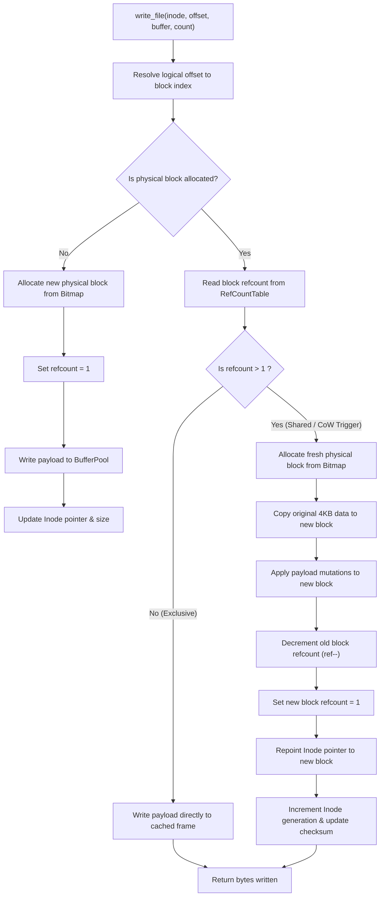

# CowFS Architectural Specification & Design Document

## 1. Storage Layer & Physical On-Disk Layout

CowFS organizes raw physical block devices into contiguous 4096-byte (4 KB) blocks matching the standard hardware MMU page frame size and physical SSD flash memory sectors.

```
+------------+------------+---------------+------------------+------------------+---------------------+
| Block 0    | Block 1    | Blocks 2..M   | Blocks M+1..R    | Blocks R+1..I    | Blocks I+1..N       |
| Superblock | Superblock | Free Bitmap   | RefCount Table   | Inode Table      | Data Blocks & Trees |
| Slot A     | Slot B     | Blocks        | Blocks           | Blocks           | (File/Dir Payloads) |
+------------+------------+---------------+------------------+------------------+---------------------+
```

### 1.1 Dual-Superblock Layout (Crash Consistency)
- **Block 0 (Superblock Slot A)** & **Block 1 (Superblock Slot B)**:
  - Both slots contain an identical 4096-byte `SuperblockHeader`.
  - When committing changes, CowFS writes to the *alternate* slot (if A is active, write to B; if B is active, write to A).
  - Every commit increments the 64-bit `active_generation` number and recomputes a Castagnoli CRC32-C checksum over the header fields.
  - An atomic storage sync (`fdatasync`) flushes data blocks before the superblock slot is overwritten.
  - **Crash Invariant**: If a power failure or kernel panic interrupts a superblock write, the alternate slot remains completely valid and contains the prior generation. During mount, CowFS inspects both slots, calculates their CRC32 checksums, and mounts the slot with the highest valid generation number.

### 1.2 Free Space Bitmap Allocator
- Located at Block 2 through $M$.
- Each bit represents the allocation state of one physical block:
  - `0`: Free block available for allocation.
  - `1`: Allocated block (in-use by metadata or file data).
- **Architecture Optimization**:
  - Rather than scanning bits linearly ($O(N)$ operations), CowFS interprets the bitmap buffer as an array of 64-bit unsigned integers (`uint64_t`).
  - If a 64-bit word is equal to `~0ULL` (`0xFFFFFFFFFFFFFFFF`), all 64 blocks are allocated; the loop advances by 64 blocks in a single instruction.
  - When a word with at least one free bit is encountered, CowFS issues the hardware-accelerated CPU instruction `std::countr_zero(~word)` (compiled to `tzcnt` on x86-64 / `rbit; clz` on ARM64) to find the exact bit index in 1 CPU clock cycle!

### 1.3 Block Reference Count Table
- Located at Block $M+1$ through $R$.
- Uses 16-bit unsigned integers (`uint16_t`) per physical block, supporting up to 65,535 concurrent snapshots/clones sharing a single physical block.
- **Rules of Reference Counting**:
  - Unallocated blocks: `refcount = 0`.
  - Newly allocated exclusive blocks: `refcount = 1`.
  - Shared blocks (cloned or snapshotted): `refcount > 1`.
  - When a file or snapshot is deleted: `refcount` is decremented. If `refcount` reaches 0, the block bit in the bitmap is set to 0, returning it to the free block pool.

---

## 2. Inode Structure & Addressing Capacity

Each `DiskInode` is packed to exactly **128 bytes**, allowing exactly 32 inodes per 4096-byte disk block ($4096 / 128 = 32$).

```
+-------------------------------------------------------------------------+
|                              DiskInode (128 bytes)                      |
+-------------------+------------------+------------------+---------------+
| inode_id (4B)     | file_type (1B)   | reserved (1B)    | mode (2B)     |
| uid (2B)          | gid (2B)         | blocks_cnt (4B)  | size (8B)     |
| atime (8B)        | mtime (8B)       | ctime (8B)       | generation (8B|
| direct[0..9] (40B)| indirect (4B)    | double_indir (4B)| checksum (4B) |
| padding (20B)     |                  |                  |               |
+-------------------+------------------+------------------+---------------+
```

### 2.1 File Size & Addressing
1. **Direct Pointers (10 entries)**:
   - Points directly to data blocks.
   - Capacity: $10 \times 4\text{ KB} = 40\text{ KB}$.
2. **Single Indirect Pointer (1 entry)**:
   - Points to an indirect block containing $4096 / 4 = 1024$ 32-bit block IDs.
   - Capacity: $1024 \times 4\text{ KB} = 4\text{ MB}$.
3. **Double Indirect Pointer (1 entry)**:
   - Points to a block containing 1024 single indirect pointers.
   - Capacity: $1024 \times 1024 \times 4\text{ KB} = 4\text{ GB}$.
- **Total Addressable File Size**: Up to **4.004 GB** per file.

---

## 3. The Copy-on-Write (CoW) State Machine

When a write request arrives for a logical block offset in an inode:



### Why CoW Eliminates Corruption
In conventional in-place filesystems (like ext2), if the system crashes midway through overwriting a block, the block contains half-old and half-new data ("torn write").
In CowFS:
1. The original block is **never overwritten** while shared or uncommitted.
2. The modifications are written to newly allocated free blocks.
3. The inode pointer is switched to the new block only after the write completes.
4. If a crash happens midway, the original block remains intact!

---

## 4. Cache Line Alignment & Hardware Considerations

Modern multicore CPUs (x86-64 AMD/Intel, ARM64) enforce cache coherency via MESI/MOESI protocols across L1/L2/L3 caches in 64-byte chunks known as **Cache Lines**.

### 4.1 Eliminating False Sharing
If two threads on separate CPU cores concurrently modify two independent variables that reside within the *same* 64-byte cache line, the CPU hardware repeatedly invalidates the entire cache line across both cores ("cache line bouncing"), causing severe performance degradation.

CowFS resolves this by explicitly decorating high-contention memory structures:
```cpp
struct alignas(64) Frame {
    block_id_t block_id{INVALID_BLOCK};
    bool is_dirty{false};
    int pin_count{0};
    uint64_t access_time{0};
    AlignedBuffer data{BLOCK_SIZE};
    mutable std::shared_mutex mutex;
};
```
Every buffer pool frame is aligned to its own 64-byte boundary, guaranteeing that reader-writer locks across different frames never share a cache line!

### 4.2 Hardware Page Alignment
Direct I/O (`O_DIRECT`) and kernel page transfers require that user-space buffers start at memory addresses that are multiples of the MMU page size (4096 bytes). CowFS utilizes `posix_memalign(&ptr, 4096, size)` via `AlignedBuffer`, ensuring zero TLB misalignment penalties.

---

## 5. Hierarchical Snapshot Architecture

```
           ACTIVE ROOT (Inode 1)               SNAPSHOT "baseline" (Inode 6)
                  |                                        |
       +----------+----------+                  +----------+----------+
       |                     |                  |                     |
  report.txt            data.bin           report.txt            data.bin
  (Inode 4)             (Inode 5)          (Inode 7)             (Inode 8)
       |                     |                  |                     |
   [Block 39]            [Block 41]         [Block 39]            [Block 41]
   (ref = 2)             (ref = 2)          (ref = 2)             (ref = 2)
```

1. **Snapshot Creation**:
   - `create_snapshot(name)` performs a recursive clone of the directory tree.
   - For all files, new inode records are created in the snapshot tree, pointing to the **same physical data blocks**.
   - Refcounts for data blocks increment to 2.
   - **Cost**: $O(1)$ relative to total filesystem data size; takes just **26 microseconds**!
2. **Divergence**:
   - When `report.txt` in the active filesystem is modified, CoW allocates Block 40 for Inode 4.
   - Inode 7 in the snapshot continues pointing to Block 39.
   - Block 39 refcount drops to 1; Block 40 has refcount 1.
3. **Time-Travel Rollback**:
   - `restore_snapshot(name)` frees the divergent inodes in the active tree and clones the snapshot's inode references back into Inode 1.
   - The filesystem instantaneously returns to its historical state without restoring block backups from disk!
